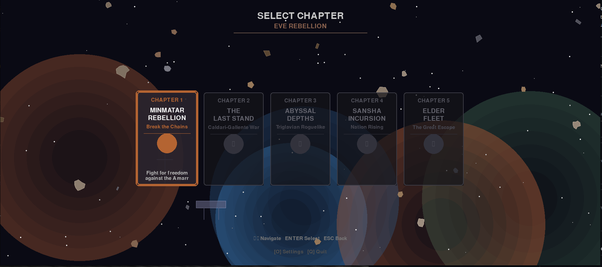
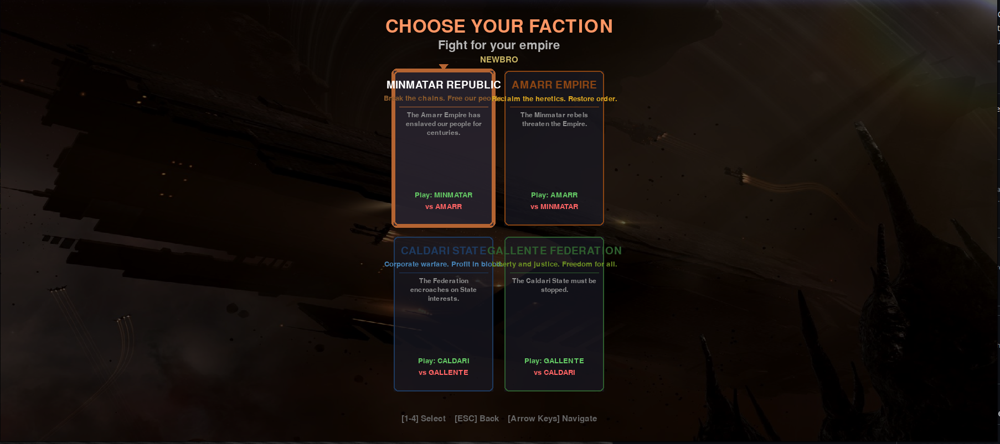
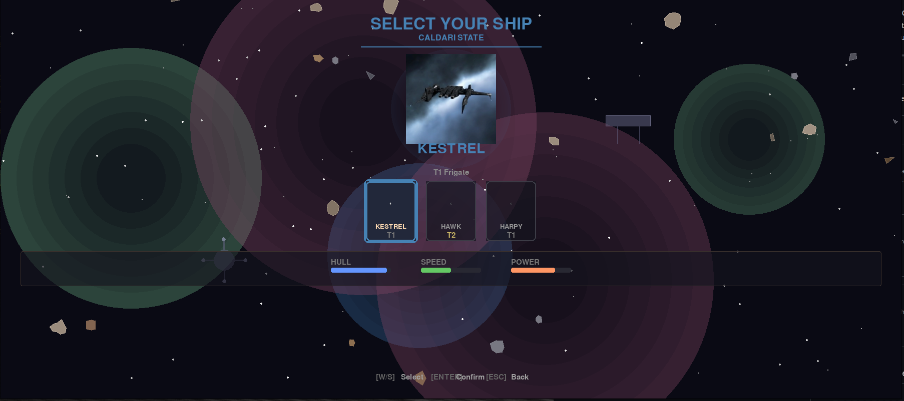
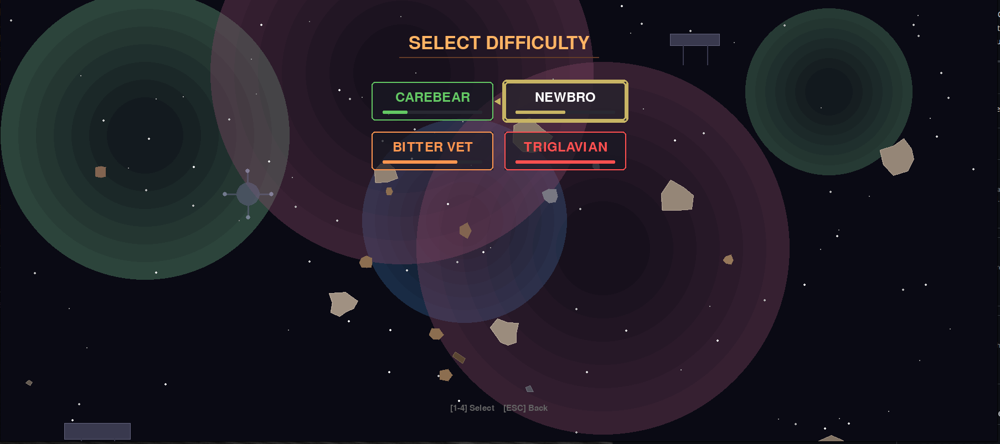

# Minmatar Rebellion

**A top-down arcade shooter set in the EVE Online universe. Fight for freedom across 4 faction campaigns.**

[](https://github.com/AreteDriver/EVE_Rebellion/actions/workflows/ci.yml)
[](https://codecov.io/gh/AreteDriver/EVE_Rebellion)
[](LICENSE)
[](https://www.python.org/downloads/)
[](https://www.pygame.org/)
[](https://github.com/astral-sh/ruff)
[]()

---

## Screenshots

### Chapter Select
Five campaigns across all four EVE factions.


### Faction Selection
Choose your faction and learn the lore.


### Ship Selection
Pick your ship with stats comparison (Hull, Speed, Power).


### Difficulty Levels
Four difficulty tiers with EVE-themed names.


---

## The Premise

You are a Minmatar pilot. Your ancestors were enslaved. Your people were broken.

But not you.

In a Rifter-class frigate armed with autocannons and rockets, you'll tear through Amarr patrols, liberate slave ships, and face down battleships that outclass you a hundred to one. The odds don't matter. Freedom isn't free—it's paid for in burnt wrecks and rescued souls.

*"We were slaves once. Never again."*

---

## Features

### Combat System
- **5 Ammo Types** with rock-paper-scissors mechanics
  - Titanium Sabot (balanced starter)
  - EMP (melts shields)
  - Phased Plasma (shreds armor)
  - Fusion (high alpha, slow fire)
  - Barrage (fast tracking, reduced range)
- **Autocannons + Rockets** - Primary and secondary weapons
- **Berserk System** - Get closer for higher score multipliers (0.5x to 5.0x)

### Campaigns
- **Minmatar Rebellion** - Escape slavery, liberate your people from the Amarr Empire
- **Amarr Crusade** - Purge the heretics threatening the Empire's holy borders
- **Caldari Defense** - Protect the State from Gallente aggression
- **Gallente Liberation** - Free the oppressed from Caldari corporate tyranny

### Progression
- **Refugee Economy** - Destroy transports, collect escape pods, spend lives on upgrades
- **Ship Upgrades** - Gyrostabilizers, armor plates, tracking enhancers
- **Unlock T2 Ships** - Upgrade to faction Assault Frigates with bonuses
- **32 Stages** - 8 stages per faction campaign

### Technical
- **Procedural Audio** - All sounds synthesized in real-time (no audio files needed)
- **Controller Support** - Full gamepad support with analog movement
- **4 Difficulty Levels** - Easy to Nightmare
- **Data-Driven Design** - Add enemies, stages, and bosses via JSON

### Polish
- **Screen Shake** - Impactful combat feedback
- **Parallax Backgrounds** - Layered space environments
- **Visual Effects** - Glows, explosions, damage indicators
- **60 FPS** - Smooth arcade action

---

## Installation

### Requirements
- Python 3.8+
- ~50MB disk space

### Quick Start

```bash
# Clone the repository
git clone https://github.com/AreteDriver/EVE_Rebellion.git
cd EVE_Rebellion

# Install dependencies
pip install pygame numpy cairosvg

# Play
python main.py
```

### Linux One-Liner

```bash
pip install pygame numpy cairosvg && python main.py
```

### Verify Installation

```bash
python -c "import pygame; import numpy; print('Ready to rebel!')"
```

---

## Controls

### Keyboard + Mouse

| Action | Primary | Alternative |
|--------|---------|-------------|
| Move | WASD | Arrow Keys |
| Fire Autocannons | Space | Left Click |
| Fire Rockets | Shift | Right Click |
| Select Ammo | 1-5 | - |
| Cycle Ammo | Q | Tab |
| Pause | ESC | - |

### Controller (Xbox/PlayStation)

| Action | Button |
|--------|--------|
| Move | Left Stick |
| Aim Offset | Right Stick |
| Fire (pressure-sensitive) | RT / R2 |
| Rockets | LT / L2 |
| Cycle Ammo Forward | RB / R1 |
| Cycle Ammo Back | LB / L1 |
| Collect Refugees | A / Cross |
| Emergency Burn | B / Circle |
| Pause | Start |

### Menu

| Action | Key |
|--------|-----|
| Toggle Sound | S |
| Toggle Music | M |

---

## Gameplay Guide

### The Berserk System

Your score multiplier depends on how close you are when you destroy an enemy:

| Range | Distance | Multiplier | Risk |
|-------|----------|------------|------|
| EXTREME | 0-80px | 5.0x | Maximum |
| CLOSE | 80-150px | 3.0x | High |
| MEDIUM | 150-250px | 1.5x | Moderate |
| FAR | 250-400px | 1.0x | Low |
| VERY FAR | 400+px | 0.5x | None |

Playing safe gets you through stages. Playing aggressive gets you on the leaderboard.

### Ammo Selection

| Ammo | Key | Color | Best Against | Fire Rate |
|------|-----|-------|--------------|-----------|
| Titanium Sabot | 1 | Gray | Balanced starter | Normal |
| EMP | 2 | Blue | Shields (Executioners) | Normal |
| Phased Plasma | 3 | Orange | Armor (Punishers, Mallers) | Normal |
| Fusion | 4 | Red | Everything (high damage) | Slow |
| Barrage | 5 | Yellow | Fast targets | Fast |

Unlock ammo types at the Rebel Station between stages.

### Refugee System

1. **Find Industrials** - Bestowers and Sigils carry slaves
2. **Destroy Them** - Escape pods eject on death
3. **Collect Pods** - Fly into them before they drift away
4. **Spend Refugees** - Buy upgrades at the Rebel Station

Refugees are your only currency. Every upgrade costs lives saved.

### Upgrades

| Upgrade | Cost | Effect |
|---------|------|--------|
| Gyrostabilizer | 10 | +30% fire rate |
| Armor Plate | 15 | +30 max armor |
| Tracking Enhancer | 20 | +1 gun spread |
| EMP Ammo | 25 | Unlock EMP rounds |
| Phased Plasma | 35 | Unlock Plasma rounds |
| Fusion Ammo | 45 | Unlock Fusion rounds |
| Barrage Ammo | 55 | Unlock Barrage rounds |
| **Wolf Upgrade** | 50 | T2 Assault Frigate! |

### Power-ups

Dropped by enemies:

| Power-up | Color | Effect |
|----------|-------|--------|
| Nanite Paste | Green | Repairs hull damage |
| Capacitor Booster | Blue | Refills rocket ammo |
| Overdrive | Yellow | Temporary speed boost |
| Shield Booster | Light Blue | Damage reduction + shield repair |

---

## Campaign

### Core Stages (1-5)

| Stage | Name | Challenge |
|-------|------|-----------|
| 1 | Asteroid Belt Escape | Tutorial, basic frigates |
| 2 | Amarr Patrol Interdiction | Cruisers, mini-boss |
| 3 | Slave Colony Liberation | High refugee opportunity |
| 4 | Gate Assault | Boss: Apocalypse Battleship |
| 5 | Final Push | Boss: Abaddon Dreadnought |

### Expansion Stages (6-8)

| Stage | Name | Boss |
|-------|------|------|
| 6 | Capital Ship Assault | Golden Supercarrier |
| 7 | Sisters Rescue | Stratios (SoE Cruiser) |
| 8 | Pirate Invasion | Machariel (Angel Cartel) |

---

## Enemy Recognition

### Frigates
- **Executioner** - Fast, shield-tanked. Use EMP. Aggressive patterns.
- **Punisher** - Slow, armor-tanked. Use Plasma. Steady approach.

### Cruisers
- **Omen** - Balanced defenses. Flanking maneuvers.
- **Maller** - Heavy armor brick. Circular strafing.

### Industrials
- **Bestower / Sigil** - Non-combat. YOUR PRIMARY TARGETS. Drop refugees!

### Bosses
- **Apocalypse** - Battleship. Spread fire patterns. Multi-phase.
- **Abaddon** - Dreadnought. Enrages at low health.
- **Supercarrier** - Capital. Multi-turret system. The ultimate challenge.

---

## Difficulty Levels

| Level | Enemy Health | Enemy Damage | Power-ups | Description |
|-------|--------------|--------------|-----------|-------------|
| Easy | -30% | -30% | More frequent | Learn the mechanics |
| Normal | Standard | Standard | Standard | Intended experience |
| Hard | +30% | +30% | Less frequent | For veterans |
| Nightmare | +60% | +50% | Rare | Pure suffering |

---

## Configuration

All game settings are in `constants.py`:

```python
# Display
SCREEN_WIDTH = 600
SCREEN_HEIGHT = 800
FPS = 60

# Player Base Stats
PLAYER_SPEED = 5
PLAYER_BASE_FIRE_RATE = 150  # ms between shots
PLAYER_ROCKET_COOLDOWN = 500
PLAYER_START_SHIELDS = 100
PLAYER_START_ARMOR = 100
PLAYER_START_HULL = 50

# Screen Shake
SHAKE_INTENSITY = 10
SHAKE_DECAY = 0.85
```

### Adding Content

The game uses a data-driven architecture. Add new content via JSON:

**New Enemy** (`data/enemies/my_enemy.json`):
```json
{
  "name": "my_enemy",
  "display_name": "Custom Enemy",
  "health": { "shields": 50, "armor": 100, "hull": 50 },
  "behavior": "weaver",
  "speed": 3,
  "fire_rate": 1000,
  "points": 150
}
```

**New Stage** (`data/stages/my_stage.json`):
```json
{
  "name": "my_stage",
  "display_name": "Custom Stage",
  "waves": [
    { "enemies": ["executioner", "executioner"], "delay": 2000 },
    { "enemies": ["my_enemy"], "delay": 3000, "boss": true }
  ]
}
```

See `docs/development.md` for complete schemas.

---

## Project Structure

```
EVE_Rebellion/
├── main.py                 # Entry point
├── game.py                 # Game loop, states, rendering
├── sprites.py              # Player, enemies, bullets, effects
├── constants.py            # All configuration
├── sounds.py               # Procedural audio synthesis
│
├── core/
│   ├── loader.py           # JSON content loader
│   ├── controls.py         # Input configuration
│   ├── pause_menu.py       # Pause/options menu
│   ├── save_manager.py     # Save/load system
│   └── tutorial.py         # Tutorial system
│
├── data/
│   ├── enemies/            # Enemy definitions (JSON)
│   ├── stages/             # Stage definitions (JSON)
│   ├── powerups/           # Power-up definitions (JSON)
│   └── upgrades.json       # Upgrade shop data
│
├── expansion/
│   └── capital_ship_enemy.py   # Capital ship boss class
│
├── berserk_system.py       # Distance-based scoring
├── arcade_combat.py        # Combo mechanics
├── controller_input.py     # Gamepad support
├── cinematic_system.py     # Cutscenes
└── vertical_shmup_*.py     # Effects, music, controls
```

---

## Roadmap

### Planned Features
- [ ] Wingman power-up (AI companion before bosses)
- [ ] Drone waves from Amarr carriers
- [ ] Background capital ships (parallax)
- [ ] Enhanced weapon visuals
- [ ] Steam Deck optimized controls
- [ ] Leaderboard system

### Known Limitations
- Ship assets stored in separate repository (EVE_Ships) for size
- Cutscene system partially implemented
- Wolf/Jaguar upgrade cinematics pending

---

## Contributing

This is a community project. Contributions welcome!

### Ways to Help
- **Balance Feedback** - Play and report what feels off
- **New Content** - Create enemies, stages, bosses via JSON
- **Code** - Check `docs/development.md` for architecture
- **Art** - Ship sprites, effects, UI elements
- **Sound** - Improve procedural audio or add music tracks

### Development Setup

```bash
git clone https://github.com/AreteDriver/EVE_Rebellion.git
cd EVE_Rebellion
pip install pygame numpy cairosvg

# Optional: Set up pre-commit hooks for code quality
pip install pre-commit
pre-commit install

python main.py
```

Pre-commit hooks automatically run linting (ruff) before each commit to maintain code quality.

---

## Technical Notes

### Procedural Audio

All game audio is synthesized at runtime using NumPy:

```python
# No audio files required - everything generated from waveforms
- Autocannons: Low-frequency burst with decay
- Rockets: Frequency sweep (whoosh)
- Lasers: High-frequency sine wave
- Explosions: Noise burst scaled by enemy size
- UI: Arpeggios and sweeps
```

Sound gracefully disables if no audio device is available.

### Performance

- **Target**: 60 FPS on modest hardware
- **Resolution**: 600x800 (scales to display)
- **Memory**: ~100MB typical usage
- **CPU**: Single-threaded, minimal overhead

---

## License

This project is licensed under the MIT License - see the [LICENSE](LICENSE) file for details.

---

## Disclaimer

**Minmatar Rebellion is not affiliated with or endorsed by CCP Games.**

EVE Online, the EVE logo, and all associated ship names and designs are registered trademarks of CCP hf. This is an independent fan project created out of love for the EVE universe. Ship designs in this game are inspired by EVE Online but are original interpretations for this arcade context.

For any commercial use, original designs would need to be created or licensing obtained from CCP Games.

---

## Support the Project

If you enjoy this project, consider supporting development:

- **In-Game**: Send ISK donations to **AreteDriver** in EVE Online
- **Buy Me a Coffee**: [buymeacoffee.com/aretedriver](https://buymeacoffee.com/aretedriver)

Your support helps keep these projects maintained and improving. o7

---

## Acknowledgments

- **CCP Games** - For creating the EVE Online universe
- **Pygame Community** - For the excellent game framework
- **Minmatar Fleet** - You know who you are. Fly aggressive. o7

---

<p align="center">
  <em>"In rust we trust."</em>
  <br><br>
  <strong>Fly dangerous, capsuleer.</strong>
</p>
