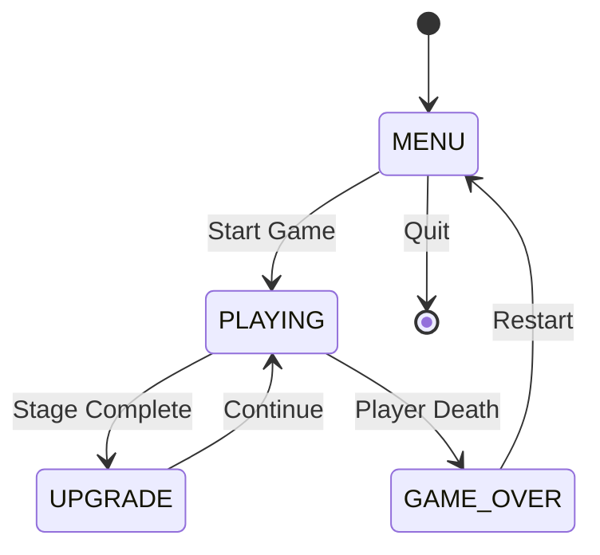

# Architecture Overview

## System Architecture

EVE Rebellion is built using an event-driven, state-machine architecture with procedural content generation.

## High-Level Architecture

```
┌─────────────────────────────────────────────────────────────┐
│                        Main Game Loop                        │
│                         (game.py)                            │
├─────────────────────────────────────────────────────────────┤
│                                                               │
│  ┌──────────┐  ┌──────────┐  ┌──────────┐  ┌──────────┐   │
│  │  MENU    │→ │ PLAYING  │→ │ UPGRADE  │→ │GAME_OVER │   │
│  │  STATE   │  │  STATE   │  │  STATE   │  │  STATE   │   │
│  └──────────┘  └──────────┘  └──────────┘  └──────────┘   │
│       ↑             │                                         │
│       └─────────────┘                                         │
└─────────────────────────────────────────────────────────────┘
         │                  │                  │
         ↓                  ↓                  ↓
┌─────────────┐   ┌─────────────────┐   ┌──────────────┐
│   Screen    │   │   Sprite        │   │   Sound      │
│   Renderer  │   │   Manager       │   │   Manager    │
│  (pygame)   │   │  (sprites.py)   │   │  (sounds.py) │
└─────────────┘   └─────────────────┘   └──────────────┘
```

## Game State Machine



## Game Loop Flow

```
┌─────────────────────────────────────────────────┐
│              GAME LOOP (60 FPS)                 │
├─────────────────────────────────────────────────┤
│                                                  │
│  1. INPUT HANDLING                              │
│     ├─ Keyboard events                          │
│     ├─ Mouse events                             │
│     └─ Game state routing                       │
│                                                  │
│  2. UPDATE (Delta Time)                         │
│     ├─ Update player position/state            │
│     ├─ Update enemies (AI tick)                │
│     ├─ Update bullets/projectiles              │
│     ├─ Collision detection                      │
│     ├─ Spawn waves/enemies                      │
│     └─ Update screen shake/effects             │
│                                                  │
│  3. RENDER                                       │
│     ├─ Clear screen                             │
│     ├─ Draw background/stars                    │
│     ├─ Draw sprites (layered)                   │
│     │   ├─ Bullets                              │
│     │   ├─ Enemies                              │
│     │   ├─ Player                               │
│     │   ├─ Explosions                           │
│     │   └─ Powerups                             │
│     ├─ Draw HUD/UI                              │
│     └─ Apply screen shake                       │
│                                                  │
│  4. FRAME LIMITING                               │
│     └─ Clock.tick(FPS)                          │
│                                                  │
└─────────────────────────────────────────────────┘
```

## Entity Component System

### Sprite Hierarchy

```
Sprite (pygame.sprite.Sprite)
├── Player
│   ├── Position & velocity
│   ├── Weapon system (autocannons, rockets)
│   ├── Ammo management
│   ├── Health/Armor/Shield
│   └── Visual state (ship type)
│
├── Enemy
│   ├── Movement AI
│   ├── Attack patterns
│   ├── Health/Armor/Shield
│   └── Loot drops
│
├── Bullet
│   ├── Position & velocity
│   ├── Damage & type
│   └── Lifetime counter
│
├── EnemyBullet (similar to Bullet)
│
├── Rocket (similar to Bullet)
│
├── Explosion
│   ├── Animation frames
│   ├── Scale/size
│   └── Lifetime
│
├── Powerup
│   ├── Type (repair, rockets, etc.)
│   ├── Drift physics
│   └── Pickup detection
│
└── EscapePod (Refugee collectible)
```

## AI State Machine (Enemy Behavior)

```
┌────────────────────────────────────────────────┐
│           Enemy AI State Machine                │
├────────────────────────────────────────────────┤
│                                                 │
│  SPAWN → ENTER → ATTACK → EXIT → DESPAWN      │
│            ↓        ↓                           │
│          DODGE    FLANK                         │
│            ↓        ↓                           │
│          CIRCLE  RETREAT                        │
│                                                 │
├────────────────────────────────────────────────┤
│                                                 │
│  Movement Patterns:                             │
│  • Sine Wave  - Smooth oscillation             │
│  • Zigzag     - Sharp direction changes        │
│  • Swoop      - Dive attack                    │
│  • Flank      - Lateral approach               │
│  • Circle     - Orbital strafing               │
│                                                 │
│  Decision Making:                               │
│  • Distance to player                           │
│  • Health percentage                            │
│  • Attack cooldown                              │
│  • Formation position                           │
│                                                 │
└────────────────────────────────────────────────┘
```

## Audio Synthesis Architecture

```
┌──────────────────────────────────────────────────┐
│         Procedural Sound Generation               │
├──────────────────────────────────────────────────┤
│                                                   │
│  Sound Request                                    │
│       ↓                                           │
│  ┌─────────────┐                                 │
│  │   Waveform  │                                 │
│  │  Generator  │                                 │
│  └─────────────┘                                 │
│       ↓                                           │
│  Generate NumPy Array:                           │
│  • Sine waves (pure tones)                       │
│  • Sawtooth (harsh sounds)                       │
│  • Triangle (mellow tones)                       │
│  • Noise (explosions, static)                    │
│       ↓                                           │
│  ┌─────────────┐                                 │
│  │   ADSR      │                                 │
│  │  Envelope   │                                 │
│  └─────────────┘                                 │
│       ↓                                           │
│  Apply Envelope:                                 │
│  • Attack  - Quick rise                          │
│  • Decay   - Drop to sustain                     │
│  • Sustain - Held level                          │
│  • Release - Fade out                            │
│       ↓                                           │
│  ┌─────────────┐                                 │
│  │  Effects    │                                 │
│  │  Layer      │                                 │
│  └─────────────┘                                 │
│       ↓                                           │
│  Apply Effects:                                  │
│  • Frequency sweep                               │
│  • Amplitude modulation                          │
│  • Pitch bend                                    │
│       ↓                                           │
│  ┌─────────────┐                                 │
│  │  Convert    │                                 │
│  │  to Pygame  │                                 │
│  │  Sound      │                                 │
│  └─────────────┘                                 │
│       ↓                                           │
│  Play through mixer                              │
│                                                   │
└──────────────────────────────────────────────────┘

Example: Autocannon Sound
-------------------------
1. Generate 80ms of noise
2. Apply bandpass filter (200-800 Hz)
3. Apply ADSR (fast attack, short release)
4. Add frequency sweep (high to low)
5. Convert to 16-bit stereo
6. Play with random pitch variation
```

## Performance Optimization Patterns

### 1. Object Pooling
- Bullets are reused rather than created/destroyed
- Reduces garbage collection pressure

### 2. Spatial Partitioning
- Off-screen entities don't update
- Collision detection uses simple bounds first

### 3. Event-Driven Updates
- Only update what changed
- State machines prevent redundant computation

### 4. Lazy Loading
- Sounds generated once at startup
- Ship images cached after first draw

### 5. Frame-Rate Independent Physics
- Delta time used for all movement
- Consistent behavior across different FPS

## Data Flow: Player Shoots Enemy

```
1. Player presses SPACE
   ↓
2. game.py handles input
   ↓
3. Player.shoot() called
   ↓
4. Check fire rate cooldown
   ↓
5. Create Bullet sprite(s)
   ↓
6. Add to bullet sprite group
   ↓
7. Play autocannon sound
   ↓
8. Next frame: Bullet.update()
   ↓
9. Move bullet position
   ↓
10. Collision detection
    ↓
11. If hit enemy:
    - Damage enemy
    - Create explosion
    - Play explosion sound
    - Check if enemy destroyed
    - Drop powerup/refugee (random)
    - Remove bullet
```

## Stage Progression System

```
Stage Definition (constants.py)
       ↓
Load stage waves
       ↓
┌──────────────────┐
│  Wave Spawning   │
│                  │
│  Timer → Check   │
│           ↓      │
│    Spawn Enemy   │
│           ↓      │
│  Add to group    │
│                  │
└──────────────────┘
       ↓
All waves complete?
       ↓
    YES → Upgrade screen
    NO  → Continue spawning
```

## Key Design Patterns

1. **State Pattern**: Game states (Menu, Playing, Upgrade, Game Over)
2. **Observer Pattern**: Sound events triggered by game events
3. **Strategy Pattern**: Enemy AI behaviors
4. **Singleton Pattern**: Sound and music managers
5. **Factory Pattern**: Sprite creation based on type

## Technology Stack

- **Language**: Python 3.8+
- **Game Engine**: Pygame 2.0+
- **Audio**: NumPy for synthesis, Pygame mixer for playback
- **Graphics**: Procedural (Pygame draw primitives)
- **No external assets**: All graphics and audio generated at runtime

## Modularity

Each module has a clear responsibility:

- `main.py` - Entry point and initialization
- `game.py` - Game loop and state management
- `sprites.py` - All game entities and visual logic
- `constants.py` - Configuration and balance tuning
- `sounds.py` - Audio synthesis and management
- `upgrade_screen.py` - Upgrade UI and progression

This separation allows for:
- Easy testing of individual components
- Simple balance adjustments (edit constants)
- Clear code organization
- Minimal coupling between systems
